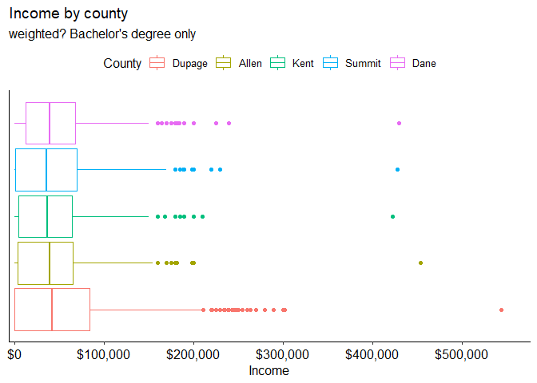

average wage select counties
================

``` r
library(tidyverse)
```

``` r
load(here::here("data", "acs2019.RData"))
```

joining fips codes into one code so we can use the codes given by fact
finder

``` r
counties <- acs2019 %>% 
  unite("state_county", statefip, countyfip, sep = "", na.rm = TRUE, remove = FALSE)
```

filtering counties of interest

``` r
counties <- counties %>% 
  filter(state_county %in% c(2681, 39153, 183, 1743, 5525))

counties$state_county <- factor(counties$state_county, labels = c("Dupage", "Allen", "Kent", "Summit", "Dane"))

counties <- counties %>% 
  mutate(highest_deg = case_when(educd < 62 ~ "Less than HS",
                                 educd < 81 ~ "High School",
                                 educd < 101 ~ "Associates",
                                 educd < 114 ~ "Bachelors",
                                 TRUE ~ "Grad"),
         highest_deg = factor(highest_deg)) #will need to reconsider these blocks

counties <- counties %>% 
  rename(county = state_county)
```

As a reminder, table below shows what city a county is a proxy for

| County Proxy | City             |
|--------------|------------------|
| Dupage       | Naperville, IL   |
| Allen        | Fort Wayne, IN   |
| Kent         | Grand Rapids, MI |
| Summit       | Akron, OH        |
| Dane         | Madison, WI      |

summary table. The data is so skewed right this probably isn’t very
useful. Maybe do weighted median?

``` r
counties %>% 
  group_by(county) %>% 
  summarize(mean_wage = weighted.mean(incwage, perwt), n = n()) %>% 
  knitr::kable()
```

| county | mean\_wage |    n |
|:-------|-----------:|-----:|
| Dupage |   235086.1 | 9374 |
| Allen  |   248912.1 | 3872 |
| Kent   |   238468.4 | 4465 |
| Summit |   208130.9 | 4875 |
| Dane   |   216662.9 | 3792 |

graphing

``` r
#when am I supposed to use weights
counties %>% 
  ggplot(aes(x = incwage))+
  geom_boxplot(aes(weight = perwt, color = county))+
  labs(x = "Income",
       color = "County",
       title = "Income by county",
       subtitle = "weighted?")+
  scale_x_continuous(labels = scales::dollar,
                     expand = expansion(mult = c(.01, .06)))+
  ggpubr::theme_pubr()+
  theme(axis.ticks.y = element_blank(),
        axis.text.y = element_blank())
```

<!-- -->

ANOVA to see if there is a significant difference between the counties
Normality condition technically violated but we can maybe rely on CLT?
Could also remove outliers or focus on IQR. Or use KW test. There are
also unequal variances, unsure if largest variance is more than 4 times
the smallest. Regardless, Welch’s Anova from Rstatix may be the way to
go.

``` r
anova <- aov(incwage ~ county, weights = perwt, data = counties)
summary(anova)
```

    ##                Df    Sum Sq   Mean Sq F value   Pr(>F)    
    ## county          4 5.612e+14 1.403e+14   8.064 1.71e-06 ***
    ## Residuals   26373 4.588e+17 1.740e+13                     
    ## ---
    ## Signif. codes:  0 '***' 0.001 '**' 0.01 '*' 0.05 '.' 0.1 ' ' 1

We conclude from the ANOVA that there is a significant difference in
earnings between the counties. We can use Tukey to find out which
differences specifically are different. (Could use Bonferroni to be more
conservative)

``` r
TukeyHSD(anova)
```

    ##   Tukey multiple comparisons of means
    ##     95% family-wise confidence level
    ## 
    ## Fit: aov(formula = incwage ~ county, data = counties, weights = perwt)
    ## 
    ## $county
    ##                     diff        lwr         upr     p adj
    ## Allen-Dupage   13826.000  -5706.258  33358.2566 0.3008243
    ## Kent-Dupage     3382.259 -15209.451  21973.9702 0.9877394
    ## Summit-Dupage -26955.181 -45009.562  -8900.7995 0.0004468
    ## Dane-Dupage   -18423.209 -38100.734   1254.3172 0.0791484
    ## Kent-Allen    -10443.740 -32896.343  12008.8630 0.7104439
    ## Summit-Allen  -40781.181 -62790.914 -18771.4470 0.0000043
    ## Dane-Allen    -32249.208 -55608.846  -8889.5698 0.0015587
    ## Summit-Kent   -30337.440 -51516.935  -9157.9454 0.0008869
    ## Dane-Kent     -21805.468 -44384.559    773.6228 0.0642933
    ## Dane-Summit     8531.972 -13606.779  30670.7240 0.8313053

The significant differences are

-   Summit and Dupage (Dupage pays more)
-   Summit and Allen (Allen pays more)
-   Dane and Allen (Allen pays more)
-   Summit and Kent (Kent plays more)

Looking closely at the Tukey output, the outliers are really skewing the
results. It may be beneficial to either remove outliers or look only
within IQR.

The cities may also not have been chosen well to be compared to Kent
County (which is what we’re really interested in)

## Just looking at people with Bachelors

``` r
undergrad <- counties %>% 
  filter(highest_deg == "Bachelors")

undergrad %>% 
  ggplot(aes(x = incwage))+
  geom_boxplot(aes(weight = perwt, color = county))+
  labs(x = "Income",
       color = "County",
       title = "Income by county",
       subtitle = "weighted? Bachelor's degree only")+
  scale_x_continuous(labels = scales::dollar,
                     expand = expansion(mult = c(.01, .06)))+
  ggpubr::theme_pubr()+
  theme(axis.ticks.y = element_blank(),
        axis.text.y = element_blank())
```

<!-- -->

Normality and variance assumptions likely violated. KW or Welch anova
may be best. but I’ll continue with ANOVA for now.

``` r
under_anova <- aov(incwage ~ county, weights = perwt, data = undergrad)
summary(under_anova)
```

    ##               Df    Sum Sq   Mean Sq F value   Pr(>F)    
    ## county         4 1.258e+13 3.146e+12    6.03 7.73e-05 ***
    ## Residuals   5397 2.815e+15 5.217e+11                     
    ## ---
    ## Signif. codes:  0 '***' 0.001 '**' 0.01 '*' 0.05 '.' 0.1 ' ' 1

significant difference between counties tukey to do pair-wise

``` r
TukeyHSD(under_anova)
```

    ##   Tukey multiple comparisons of means
    ##     95% family-wise confidence level
    ## 
    ## Fit: aov(formula = incwage ~ county, data = undergrad, weights = perwt)
    ## 
    ## $county
    ##                      diff        lwr       upr     p adj
    ## Allen-Dupage  -12144.2674 -21409.037 -2879.498 0.0032301
    ## Kent-Dupage    -9568.0006 -17633.298 -1502.704 0.0106629
    ## Summit-Dupage  -5142.0253 -13011.090  2727.039 0.3835533
    ## Dane-Dupage    -9138.0329 -16900.959 -1375.107 0.0115861
    ## Kent-Allen      2576.2667  -8237.483 13390.016 0.9666693
    ## Summit-Allen    7002.2420  -3665.951 17670.435 0.3788557
    ## Dane-Allen      3006.2345  -7583.911 13596.380 0.9379639
    ## Summit-Kent     4425.9753  -5218.889 14070.840 0.7205417
    ## Dane-Kent        429.9678  -9128.497  9988.432 0.9999489
    ## Dane-Summit    -3996.0075 -13389.484  5397.469 0.7737387

Significant at 5%

-   Allen Dupage (dupage pays more)
-   Kent Dupage (dupage pays more)
-   Dane Dupage (dupage pays more)

## Conclusion

At least with the counties chosen, Grand Rapids doesn’t pay
significantly less than most of the counties. The counties chosen were
intended to be similar to Grand Rapids but there may be value in
including larger cities nearby like Detroit or Chicago. It may also be
worthwhile to include counties outside of the midwest as difference in
pay may be more of a regional thing.

We should also make age-earnings profiles for the counties to see if
there’s a difference on age. We could do that with ANOVA but that sounds
painful… Maybe with some form of factor (early/mid/late career).

We’ll also want to break it down by majors
