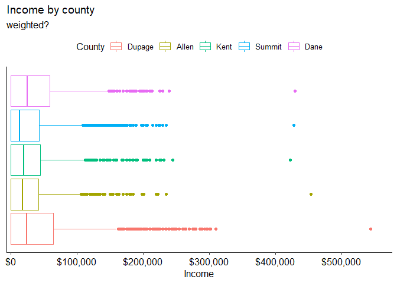

average wage select counties
================

``` r
library(tidyverse)
```

``` r
load(here::here("data", "acs2019.RData"))
```

joining fips codes into one code so we can use the codes given by fact
finder

``` r
counties <- acs2019 %>% 
  unite("state_county", statefip, countyfip, sep = "", na.rm = TRUE, remove = FALSE)
```

filtering counties of interest

``` r
counties <- counties %>% 
  filter(state_county %in% c(2681, 39153, 183, 1743, 5525))

counties$state_county <- factor(counties$state_county, labels = c("Dupage", "Allen", "Kent", "Summit", "Dane"))

counties <- counties %>% 
  rename(county = state_county)
```

summary table. The data is so skewed right this probably isn’t very
useful. Maybe do weighted median?

``` r
counties %>% 
  group_by(county) %>% 
  summarize(mean_wage = weighted.mean(incwage, perwt), n = n()) %>% 
  knitr::kable()
```

| county | mean\_wage |    n |
|:-------|-----------:|-----:|
| Dupage |   235086.1 | 9374 |
| Allen  |   248912.1 | 3872 |
| Kent   |   238468.4 | 4465 |
| Summit |   208130.9 | 4875 |
| Dane   |   216662.9 | 3792 |

graphing

``` r
#when am I supposed to use weights
counties %>% 
  ggplot(aes(x = incwage))+
  geom_boxplot(aes(weight = perwt, color = county))+
  labs(x = "Income",
       color = "County",
       title = "Income by county",
       subtitle = "weighted?")+
  scale_x_continuous(labels = scales::dollar,
                     expand = expansion(mult = c(.01, .06)))+
  ggpubr::theme_pubr()+
  theme(axis.ticks.y = element_blank(),
        axis.text.y = element_blank())
```

<!-- -->

ANOVA to see if there is a significant difference between the counties

``` r
anova <- aov(incwage ~ county, weights = perwt, data = counties)
summary(anova)
```

    ##                Df    Sum Sq   Mean Sq F value   Pr(>F)    
    ## county          4 5.612e+14 1.403e+14   8.064 1.71e-06 ***
    ## Residuals   26373 4.588e+17 1.740e+13                     
    ## ---
    ## Signif. codes:  0 '***' 0.001 '**' 0.01 '*' 0.05 '.' 0.1 ' ' 1

We conclude from the ANOVA that there is a significant difference in
earnings between the counties. We can use Tukey to find out which
differences specifically are different.

``` r
TukeyHSD(anova)
```

    ##   Tukey multiple comparisons of means
    ##     95% family-wise confidence level
    ## 
    ## Fit: aov(formula = incwage ~ county, data = counties, weights = perwt)
    ## 
    ## $county
    ##                     diff        lwr         upr     p adj
    ## Allen-Dupage   13826.000  -5706.258  33358.2566 0.3008243
    ## Kent-Dupage     3382.259 -15209.451  21973.9702 0.9877394
    ## Summit-Dupage -26955.181 -45009.562  -8900.7995 0.0004468
    ## Dane-Dupage   -18423.209 -38100.734   1254.3172 0.0791484
    ## Kent-Allen    -10443.740 -32896.343  12008.8630 0.7104439
    ## Summit-Allen  -40781.181 -62790.914 -18771.4470 0.0000043
    ## Dane-Allen    -32249.208 -55608.846  -8889.5698 0.0015587
    ## Summit-Kent   -30337.440 -51516.935  -9157.9454 0.0008869
    ## Dane-Kent     -21805.468 -44384.559    773.6228 0.0642933
    ## Dane-Summit     8531.972 -13606.779  30670.7240 0.8313053

The significant differences are

-   Summit and Dupage
-   Summit and Allen
-   Dane and Allen
-   Summit and Kent

Looking closely at the Tukey output, the outliers are really skewing the
results. It may be beneficial to either remove outliers or look only
within IQR.

The cities may also not have been chosen well to be compared to Kent
County (which is what we’re really interested in).
