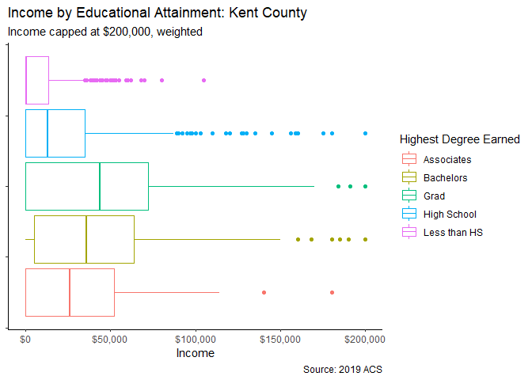
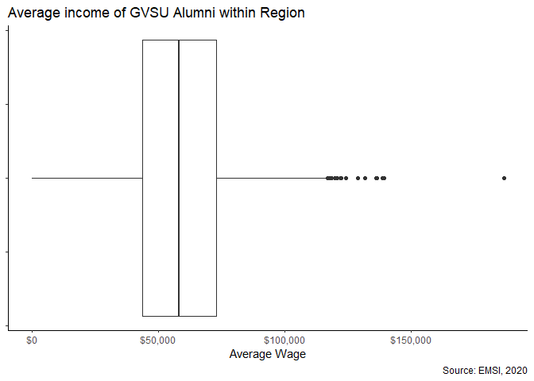
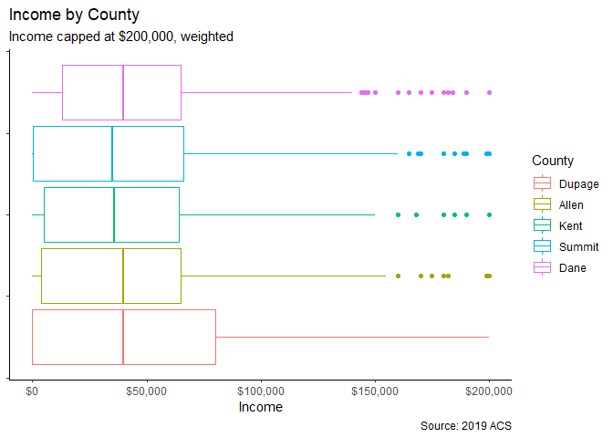
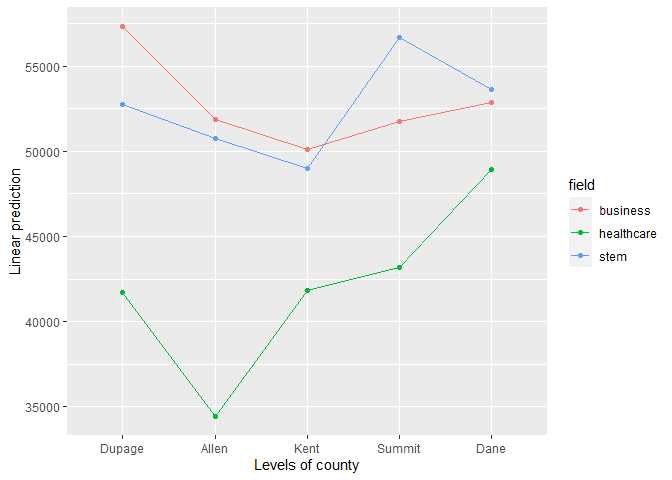

general analysis
================
Jason Smith
4/19/2021

``` r
library(tidyverse)
library(estimatr)
library(ggpubr)
library(Weighted.Desc.Stat)
library(emmeans)
```

load data

``` r
load(here::here("data", "acs2019.RData"))
load(here::here("data", "emsi.RData"))
```

get highest degree from ACS

``` r
acs2019 <- acs2019 %>%
  mutate(highest_deg = case_when(educd < 62 ~ "Less than HS",
                                 educd < 81 ~ "High School",
                                 educd < 101 ~ "Associates",
                                 educd < 114 ~ "Bachelors",
                                 TRUE ~ "Grad"),
         highest_deg = factor(highest_deg),
         incwage = case_when(incwage == 999999 ~ NA_real_,
                             incwage == 999998 ~ NA_real_,
                             TRUE ~ incwage))

acs2019 <- acs2019 %>% 
  unite("state_county", statefip, countyfip, sep = "", na.rm = TRUE, remove = FALSE)
```

only people making less than 200k

``` r
acs2019 <- acs2019 %>% 
  filter(incwage <= 200000)
```

# Do college grads in GR (kent county) earn more than than those without college

``` r
kent <- acs2019 %>% 
  filter(state_county == 2681)
```

``` r
kent %>% 
  group_by(highest_deg) %>% 
  summarise(mean = weighted.mean(incwage, perwt, na.rm = TRUE),
            sd = w.sd(incwage, perwt),
            n = n()) %>% 
  knitr::kable()
```

| highest\_deg |      mean |       sd |    n |
|:-------------|----------:|---------:|-----:|
| Associates   | 31431.083 | 32033.05 |  296 |
| Bachelors    | 41437.053 | 37758.46 |  794 |
| Grad         | 46015.937 | 43378.28 |  382 |
| High School  | 21475.067 | 25949.34 | 1713 |
| Less than HS |  9567.619 | 16748.52 |  379 |

``` r
kent %>% 
  ggplot(aes(x = incwage))+
  geom_boxplot(aes(color = highest_deg, weight = perwt))+
  scale_x_continuous(labels = scales::dollar)+
  labs(title = "Income by Educational Attainment: Kent County",
       subtitle = "Income capped at $200,000, weighted",
       x = "Income",
       color = "Highest Degree Earned",
       caption = "Source: 2019 ACS")+
  theme_classic()+
  theme(axis.text.y = element_blank())
```

<!-- -->

In Kent county, people with a college degree earn more than people
without a college degree. Specifically, people with a Bachelors makes
$31,869.43 more on average

compare with EMSI data to look at in-region alumni (bachelors only)

``` r
emsi <- emsi %>% 
  filter(Location.Status == "Resides in Region" & Level == "Baccaureate") %>% 
  uncount(Freq)
```

``` r
emsi %>% 
  summarise(mean = mean(Avg..of.Avg..Wage, na.rm = TRUE),
            sd = sd(Avg..of.Avg..Wage),
            n = n()) %>% 
  knitr::kable()
```

|     mean |       sd |     n |
|---------:|---------:|------:|
| 53862.98 | 26761.06 | 24667 |

``` r
emsi %>% 
  ggplot(aes(x = Avg..of.Avg..Wage))+
  geom_boxplot()+
  scale_x_continuous(labels = scales::dollar)+
  labs(title = "Average income of GVSU Alumni within Region",
       x = "Average Wage",
       caption = "Source: EMSI, 2020")+  
  theme_classic()+
  theme(axis.text.y = element_blank())
```

<!-- -->

GVSU graduates make more on average than college graduates in general by
\~$12,425

**the ‘in region’ defined by EMSI probably includes more than Kent
County so the estimate may be off** **at the very least we can get away
with saying GVSU grads don’t make less than other college grads in the
area**

# major breakdown

``` r
acs_majors <- acs2019 %>% 
  filter(degfield %in% c(62, 21, 24, 36, 37, 50, 61)) %>% 
  mutate(field = case_when(degfield == 62 ~ "business",
                           degfield %in% c(21, 24, 36, 37, 50) ~ "stem",
                           degfield == 61 ~ "healthcare"),
         field = as.factor(field))
```

``` r
emsi_majors <- emsi %>%
  mutate(cip_gen = round(CIP.Code)) %>% 
  filter(cip_gen %in% c(52, 11, 14, 26, 27, 40, 51)) %>% 
  mutate(field = case_when(cip_gen == 52 ~ "business",
                           cip_gen %in% c(11, 14, 26, 27, 40) ~ "stem",
                           cip_gen == 51 ~ "healthcare"))
```

``` r
kent_majors <- acs_majors %>% 
  filter(state_county == 2681)
```

# average wage of Kent by major group

``` r
kent_majors %>% 
  group_by(field) %>% 
  summarise(mean = weighted.mean(incwage, perwt, na.rm = TRUE),
            sd = w.sd(incwage, perwt),
            n = n()) %>% 
  knitr::kable()
```

| field      |     mean |       sd |   n |
|:-----------|---------:|---------:|----:|
| business   | 52902.30 | 43734.49 | 250 |
| healthcare | 41288.49 | 35547.40 |  86 |
| stem       | 51839.46 | 46659.02 | 207 |

# average wage of GV alumni by major group

``` r
emsi_majors %>% 
  group_by(field) %>% 
  summarise(mean = mean(Avg..of.Avg..Wage),
            sd = sd(Avg..of.Avg..Wage),
            n = n()) %>% 
  knitr::kable()
```

| field      |     mean |       sd |    n |
|:-----------|---------:|---------:|-----:|
| business   | 60975.06 | 26500.42 | 7975 |
| healthcare | 48597.05 | 30115.50 | 2102 |
| stem       | 58633.08 | 28285.71 | 2573 |

-   GV business majors earn about $8,072 more than business majors in
    Kent County
-   GV healthcare majors earn about $7,308 more than healthcare majors
    in Kent County
-   GV STEM majors earn about $6,793 more than STEM majors in Kent
    County

# Does the GR region pay less than other midwest cities?

``` r
counties <- acs2019 %>% 
  filter(state_county %in% c(2681, 39153, 183, 1743, 5525) & highest_deg == "Bachelors") %>% 
  mutate(state_county = factor(state_county, labels = c("Dupage", "Allen", "Kent", "Summit", "Dane"))) %>% 
  rename(county = state_county)
```

As a reminder, table below shows what city a county is a proxy for

| County Proxy | City             |
|--------------|------------------|
| Dupage       | Naperville, IL   |
| Allen        | Fort Wayne, IN   |
| Kent         | Grand Rapids, MI |
| Summit       | Akron, OH        |
| Dane         | Madison, WI      |

``` r
counties %>% 
  group_by(county) %>% 
  summarize(mean_wage = weighted.mean(incwage, perwt, na.rm = TRUE),
            sd = w.sd(incwage, perwt),
            n = n()) %>% 
  knitr::kable()
```

| county | mean\_wage |       sd |    n |
|:-------|-----------:|---------:|-----:|
| Dupage |   48451.47 | 47824.52 | 2197 |
| Allen  |   42930.98 | 39993.62 |  557 |
| Kent   |   41437.05 | 37758.46 |  794 |
| Summit |   42412.46 | 41991.61 |  835 |
| Dane   |   45222.32 | 39448.84 |  884 |

``` r
counties %>% 
  ggplot(aes(x = incwage))+
  geom_boxplot(aes(weight = perwt, color = county))+
  scale_x_continuous(labels = scales::dollar)+
  labs(title = "Income by County",
       subtitle = "Income capped at $200,000, weighted",
       x = "Income",
       color = "County",
       caption = "Source: 2019 ACS")+
  theme_classic()+
  theme(axis.text.y = element_blank())
```

<!-- -->

using ANOVA, we’ll see if there is a significant difference between the
earnings of the counties. The ANOVA assumptions of normality and
constant variance aren’t really met. We’ll rely on CLT for normality.
For constant variance, we should use welch’s ANOVA but that doesn’t let
me apply weights and I think the weights are important. ANOVA is fairly
robust so hopefully it won’t be a big deal. As consolation, we’ll use
the Holm’s method for pairwise comparision since it’s more conservative.

``` r
county_aov <- aov(incwage ~ county, weights = perwt, data = counties)
summary(county_aov)
```

    ##               Df    Sum Sq   Mean Sq F value   Pr(>F)    
    ## county         4 4.728e+12 1.182e+12   5.753 0.000129 ***
    ## Residuals   5262 1.081e+15 2.055e+11                     
    ## ---
    ## Signif. codes:  0 '***' 0.001 '**' 0.01 '*' 0.05 '.' 0.1 ' ' 1

There is a significant difference between the counties, We’ll do a
post-hoc pairwise comparision with Bonferroni correction to determine
which counties are different.

``` r
summary(pairs(emmeans(county_aov, "county")), adjust = "holm")
```

    ##  contrast        estimate   SE   df t.ratio p.value
    ##  Dupage - Allen      5520 2219 5262  2.488  0.1029 
    ##  Dupage - Kent       7014 1682 5262  4.171  0.0003 
    ##  Dupage - Summit     6039 1840 5262  3.282  0.0093 
    ##  Dupage - Dane       3229 1590 5262  2.031  0.2857 
    ##  Allen - Kent        1494 2412 5262  0.619  1.0000 
    ##  Allen - Summit       519 2525 5262  0.205  1.0000 
    ##  Allen - Dane       -2291 2349 5262 -0.976  1.0000 
    ##  Kent - Summit       -975 2069 5262 -0.471  1.0000 
    ##  Kent - Dane        -3785 1850 5262 -2.046  0.2857 
    ##  Summit - Dane      -2810 1995 5262 -1.408  0.7955 
    ## 
    ## P value adjustment: holm method for 10 tests

Of the differences that are significant to the 5%,

-   Dupage pays more than Kent
-   Dupage pays more than Summit

# Does the pay of college majors differ between counties?

``` r
counties_majors <- counties %>% 
  filter(degfield %in% c(62, 21, 24, 36, 37, 50, 61)) %>% 
  mutate(field = case_when(degfield == 62 ~ "business",
                           degfield %in% c(21, 24, 36, 37, 50) ~ "stem",
                           degfield == 61 ~ "healthcare"))
```

``` r
counties_majors_aov <- aov(incwage ~ county*field, weights = perwt, data = counties_majors)
summary(counties_majors_aov)
```

    ##                Df    Sum Sq   Mean Sq F value   Pr(>F)    
    ## county          4 1.394e+12 3.486e+11   1.478    0.206    
    ## field           2 5.104e+12 2.552e+12  10.824 2.08e-05 ***
    ## county:field    8 1.372e+12 1.715e+11   0.727    0.667    
    ## Residuals    2775 6.543e+14 2.358e+11                     
    ## ---
    ## Signif. codes:  0 '***' 0.001 '**' 0.01 '*' 0.05 '.' 0.1 ' ' 1

There’s not a significant difference in the wages of college graduates
between the selected counties. However, there is a significant
difference in wages between fields, so we’ll do pairwise testing on
field.

``` r
summary(pairs(emmeans(counties_majors_aov, "field")), adjust = "holm")
```

    ## NOTE: Results may be misleading due to involvement in interactions

    ##  contrast              estimate   SE   df t.ratio p.value
    ##  business - healthcare    10759 2671 2775  4.028  0.0002 
    ##  business - stem            224 2211 2775  0.101  0.9192 
    ##  healthcare - stem       -10535 2813 2775 -3.745  0.0004 
    ## 
    ## Results are averaged over the levels of: county 
    ## P value adjustment: holm method for 3 tests

Of the difference significant to the 5%

-   Business pays more than healthcare
-   STEM pays more than healthcare

Note: the pairwise comparision isn’t misleading in this case because all
the difference found to be significant are always true among the
counties.

``` r
emmip(counties_majors_aov, field ~ county)
```

<!-- -->

In some counties, STEM majors make more than business majors, but the
comparision didn’t say the difference found between the two majors was
significant.

# conclusions

-   college graduates make more than people without a college degree in
    Kent County
-   GVSU graduates in the region make more than the average wage of
    college graduates in Kent County (see note on EMSI’s definition of
    region)
-   This difference in earnings between GVSU graduates and other
    graduates in Kent County is true across all the major groups
-   Of the selected counties, Dupage pays more than Kent County, this
    isn’t super surprising since Dupage county is right outside Chicago
-   Wages in Kent County was lower than the other counties, but the
    differences weren’t statistically significant
-   Healthcare major group made significantly less than both business
    and STEM
-   The differences in wages between the major groups and county weren’t
    statistically significant

# cavets

-   We don’t know how EMSI defines GVSU’s region but it’s probably more
    than Kent county. Possible the more successful alumni in the region
    live outside Kent County
-   The major categories may be slightly different among the EMSI and
    ACS data. The ACS doesn’t use CIP codes for classifying majors
-   The assumptions for ANOVA analysis weren’t perfectly met, We chose
    to continue with ANOVA anyways so we could perserve the weighting of
    the ACS. Using a more conservative p-value adjustment (holms instead
    of tukey) for pairwise will hopfully account for any errors.
-   Comparison counties are all in the Midwest (east north central
    specifically). Wages may just be lower in this region in general
-   ACS doesn’t include specific cities so we used counties as a proxy.
-   Comparison counties were imperfectly selected. A more careful way of
    choosing “similar counties” may yield different results.
-   Analysis only includes people making less than 200k. I don’t
    included wealthier people would change anything but who knows.
